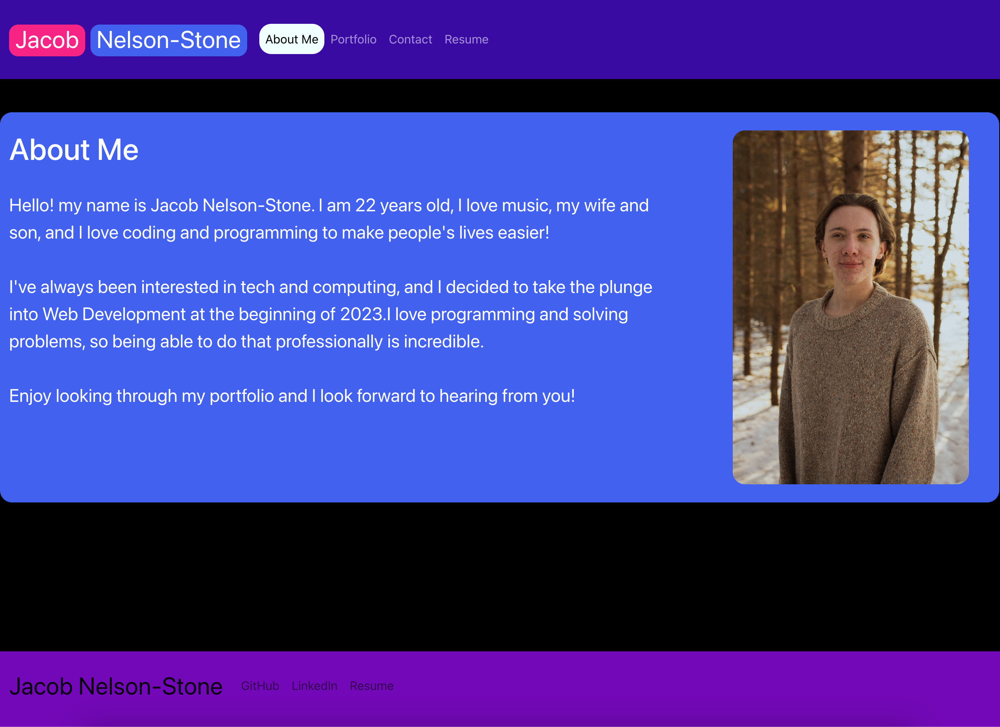

# React Portfolio  

This is my new portfolio created with the React framework. React really changes the game and allows you to build much more powerful apps in less time. The new format of a ```.jsx``` file was fun to learn about and utilize. Using mostly native JavaScript to create components in each file is incredible, and the added functionality of adding your logic and html all in one file saves so much time! This was so fun to learn and I can't wait to keep working with React! 

## Installation/Usage

To run this app, simply click on the link at the bottom of the README file. If you would like to work off of this site, you can fork or clone down my repo onto your local machine.



## Links

[Here's the link to the live web app!]()